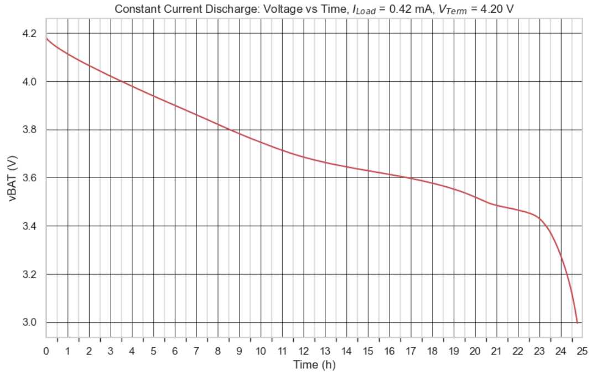
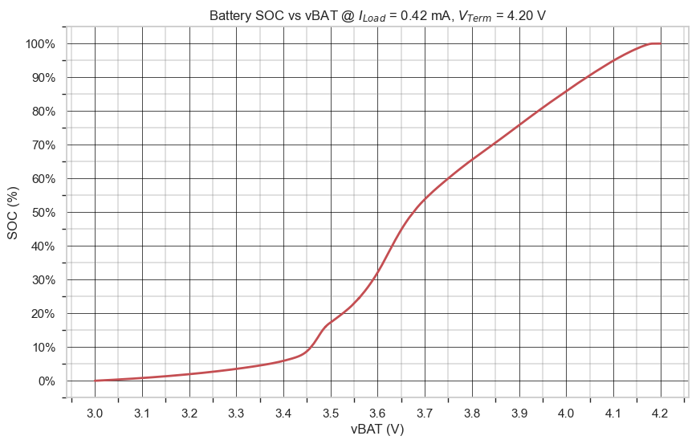
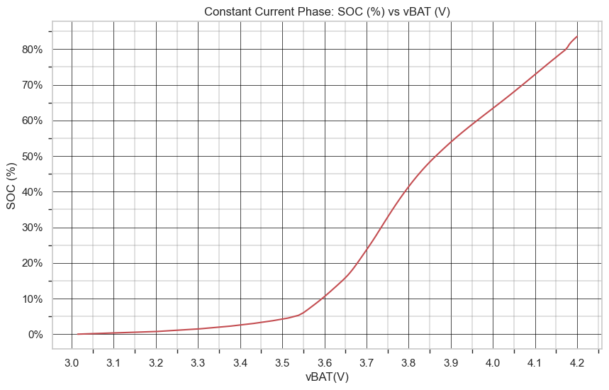

 
<h3 align=center>Wall-E</h2>
<h4 align=center>My idea of automation done right</a>.</h3>
 

# Python Automated Test Routines

## Introduction

This repo contains some battery test routines that I wrote for doing battery testing with the Keithley 2401A sourcemeter. I normally do not use this instrument for battery testing because I can only test one unit at a time, however, there are times when I need to get some data quickly and the all the channels on the Maccor battery tester are occupied.

To provide a concrete example, I tested a 10 mAh lithium coin cell.

## Background

### Interface

The Keithley 2401A supports both GPIB and RS232 interfaces. I only have RS232→USB interface cables, so I use RS232. 

### Measure Voltage Under Current Stimulus

Battery testing only requires that I measure voltage under current stimulus. To date, I have not been able to configure the 2401A for current measurement under voltage stimulus, which I need for other testing. I will work on this mode when I have time.

## Analysis

### Approach

### Discharge

### Charge

## Conclusions

## References