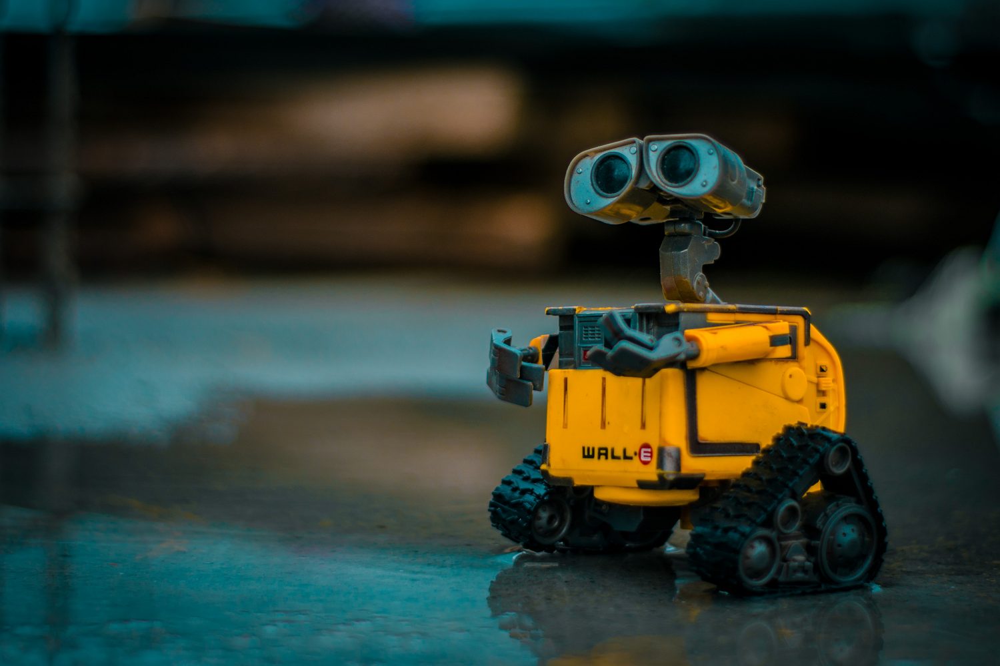

 
<h3 align=center>Wall-E</h2>
<h4 align=center>My idea of automation done right</a>.</h3>
 

# Python Automated Test Routines

## Introduction

## Background

## Analysis

## Conclusions

## References